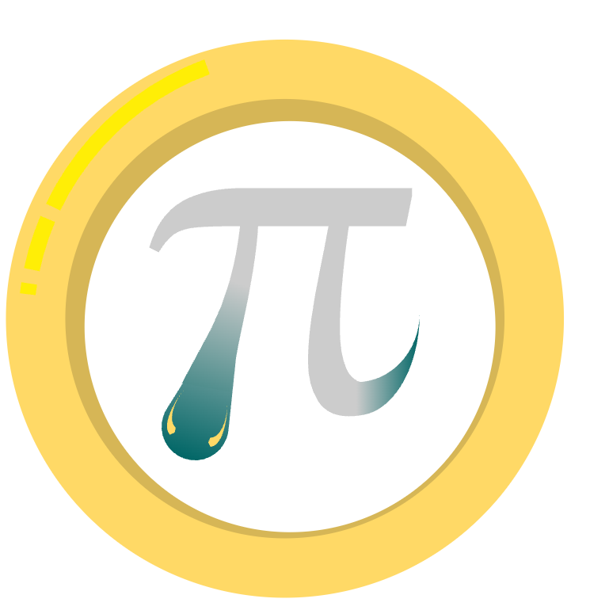

# pyo



pyo is a didactic numerical piano that can be played manually from keyboard or play songs highlighting the fingering. The project combines audio synthesis, MIDI IO, and a didactic display layer to support guided practice when learning new pieces.

## Key capabilities (planned)
- **Manual performance:** low-latency keyboard input routed through a physical or virtual MIDI device.
- **Automatic playback:** scripted sequences or imported MIDI scores drive the sound engine for demonstrations.
- **Didactic overlay:** visual hints, animated feedback, and theory callouts overlaid on the keyboard.


## Repository layout
```
pyo/
├── assets/               # Reference MIDI clips, fonts, sample configs
├── docs/                 # Architecture notes, API references, UX sketches
├── examples/             # Runnable notebooks / scripts showing key flows
├── src/pyo/              # Application packages (core, io, ui, learning)
└── tests/                # pytest suites for units + integrations
```

## Getting started
1. Install dependencies with `pip install -e .[dev]` (editable install for hacking).
2. Run the CLI shell with `pyo run` (defined in `src/pyo/cli.py`).
3. Execute tests via `pytest`.

## Next steps
- Flesh out the `core` engine to manage note scheduling and synthesis hooks.
- Build the UI layer on top of a rendering toolkit (e.g., PySide, pygame, or a web stack).
- Expand docs with UX mock-ups and audio architecture deep dives.
- Configure GitHub Actions to exercise lint/test workflows.
